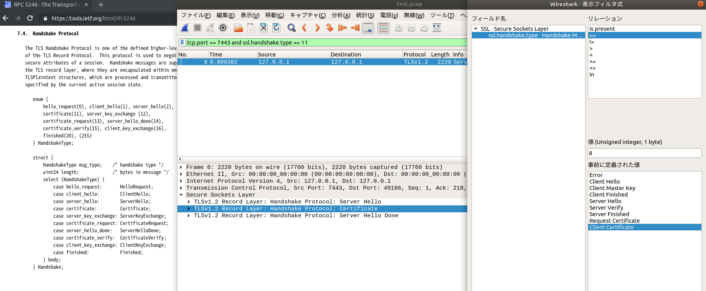

# 参考文献・メモ

正式なドキュメントにはあまり入れるべきでない、自分宛てメモ

## opnessl .cnf 雑技

謎が多すぎる

### AIA

> 利用者に OCSP レスポンダの場所を通知するために、OCSP レスポンダのアドレスが、証明書の拡張領域の認証機関アクセス情報 (AIA: Authority Information Access) に URI 形式で記載されます。

[PKI関連技術に関するコンテンツ](https://www.ipa.go.jp/security/pki/043.html)

> http://SVR1024Secure-aia.verisign.com/SVR1024Secure2007-aia.cer が中間認証局の証明書の置かれているURLである。この証明書はルート認証局から署名されているので（はずなので）、（検証すれば）安全にダウンロードすることができる。IEは、これをダウンロードすると、「中間証明機関」という証明書ストア（図2）に格納し、その後もそれを（cacheとして）使用するようになっている。

ルート証明書を置いた URL を書いているんだが... あと別に OCSP 用ではなくない?

[RFC 5280 - Internet X.509 Public Key Infrastructure Certificate and Certificate Revocation List (CRL) Profile](https://tools.ietf.org/html/rfc5280#section-4.2.2.1)

```
   AuthorityInfoAccessSyntax  ::=
           SEQUENCE SIZE (1..MAX) OF AccessDescription
   AccessDescription  ::=  SEQUENCE {
           accessMethod          OBJECT IDENTIFIER,
           accessLocation        GeneralName  }
   id-ad OBJECT IDENTIFIER ::= { id-pkix 48 }
   id-ad-caIssuers OBJECT IDENTIFIER ::= { id-ad 2 }
   id-ad-ocsp OBJECT IDENTIFIER ::= { id-ad 1 }
```

両方置けるし、置くべきか。 https://www.cybertrust.co.jp/jcsi/CPS_JCSIRoot_Ver2.0.pdf

, が sequence を意味するみたい。

```
authorityInfoAccess    = caIssuers;URI:http://$CRLAIA/$CANAME.cer,OCSP;URI:http://$CRLAIA
```

### X.509 extension

Windows の Enterprise CA や FIDO authenticator など、普通のサーバ証明書では目にしないベンダ独自の定義が .X509 extension に加えられている場合がある__テスト用に__これらの情報を含めた証明書を生成したい場合は、面倒だが以下で大体対応できるはず。

oid_section で指定したセクションで, ベンダ固有のOIDを定義できる. こんな感じ

```
oid_section = new_oids

[ new_oids ]
microsoft = 1.3.6.1.4.1.311
MS_ENROLLMENT_NAME_VALUE_PAIR = ${microsoft}.13.2.1
MS_ID_ENROLLMENT_CSP_PROVIDER = ${microsoft}.13.2.2
MS_OS_VERSION                 = ${microsoft}.13.2.3
```

上記で定義した OID 名は証明書を生成(openssl ca)するときに -extensions で指定するセクションで使う。
左辺において代入すると値が設定できる。OIDのセクションと並べるときもいがそういうものなのだ。

```
[ ext_fido ]
YUBIKEY_DEVICE_ID = DER:312e332e362e312e342e312e34313438322e312e37
ID_FIDO_GEN_CE_AAGUID = ASN1:FORMAT:HEX,OCT:CB69481E8FF7403993EC0A2729A154A8
ID_FIDO_U2F_CE_TRANSPORTS = ASN1:FORMAT:BITLIST,BITSTRING:2
```

右辺の 
- ASN1:
  - openssl asn1parse で使われるASN1形式が使われている
  - 署名に加えるときに [RFC 5280 4.1. Basic Certificate Fields](https://tools.ietf.org/html/rfc5280#section-4.1) に基づき octet string でカプセル化される
- DER: 
  - 生のデータ

企業独自の extension の中には octetstring でカプセル化する想定をしていない形式のものがあるようだ。少なくとも microsoft のエンタープライズCAと yubico の attestation key がそうなっていて、この場合 .cnf では ASN1:... の書式で設定できず、カプセル化されない DER 形式で設定することになる。ASN1 での表現がわかっていれば、以下のようなかんじで DER にできる。

```
openssl asn1parse -genstr 'FORMAT:HEX,OCT:CB69481E8FF7403993EC0A2729A154A8' -noout -out - | python -c "
import sys
import codecs
data = sys.stdin.buffer.read()
print('DER:'+data.hex())
"
DER:0410cb69481e8ff7403993ec0a2729a154a8
```

カプセル化可能なデータは

```
ID_FIDO_GEN_CE_AAGUID = FORMAT:HEX,OCT:cb69481e8ff7403993ec0a2729a154a8
```

のように ASN1 で設定するほうがまだわかりやすいが、一応

```
ID_FIDO_GEN_CE_AAGUID = DER:0410cb69481e8ff7403993ec0a2729a154a8
```

でも等価になる。上記の場合、octet string cb69481e8ff7403993ec0a2729a154a8 について DER:0410... の 0x0410 はカプセル化によって付加される。0x04 は octet string データ型, 0x10 はバイト長の意味。DER 形式の場合これが openssl ca コマンドでは付加されないので、予めデータの一部としておくことで等価になる。

以下のようなより面倒な状況も考えられるが、今のところ調べていない。

- 実行時に値を設定したい
  - 数が少ないなら環境変数を使うか、別ファイルを openssl ca に指定できるオプションとかアレばそれが使えるんでは
- 構造化された ASN1 
  - asn1parse レベルの表現はどうにかすればできるかも。わからん

## その他

### Ubuntu

Ubuntu で独自に認証局証明書を追加する場合、 /usr/local/share/ca-certificates 以下に置いてコマンド

```
sudo update-ca-certificates
```

で /etc/ca-certificates.conf に反映される。 curl や git はこれで対応できるようだ。

ホストのブラウザの以下を加える

- [debian環境のルート証明書を更新した話](https://kamatari.github.io/2015/03/12/how-to-install-root-certificate-on-debian/)
  - python の urllib
  - curl
- [ubuntuに自己認証局の証明書を登録](https://mistymagich.wordpress.com/2012/01/17/ubuntu%E3%81%AB%E8%87%AA%E5%B7%B1%E8%AA%8D%E8%A8%BC%E5%B1%80%E3%81%AE%E8%A8%BC%E6%98%8E%E6%9B%B8%E3%82%92%E7%99%BB%E9%8C%B2/)
  - git

### Firefox

- [Firefox 52以降でのルート証明書の自動インポート機能でできること、できないこと](http://www.clear-code.com/blog/2017/6/1.html)
  - Windows の場合は管理者がOSにインストールした証明書をインポートする機能があるようだ


## cipher suite

### AESGCM

[理解してるつもりの SSL/TLS でも、もっと理解したら面白かった話](http://tkengo.github.io/blog/2015/12/01/https-details/)
> 暗号化と同時に完全性や認証性も実現するための暗号方式 (たとえば GCM) が考案され、それらを総称して AEDA (Authenticated Encryption with Asocciated Data) と呼ばれます。暗号スイートの Mac の部分に AEAD という表記があるものは、暗号モードとして認証付き暗号の GCM が利用されています。

AESGCM とした場合 mac は指定せず 'ECDH+aRSA+AESGCM' などとするようだ。ECDH+aRSA+AESGCM+SHA256 としてもヒットしない。

```
bash-4.4# openssl ciphers -s -stdname -v -tls1 -tls1_1 -tls1_2 'ECDHE+aRSA+AESGCM'
TLS_ECDHE_RSA_WITH_AES_256_GCM_SHA384 - ECDHE-RSA-AES256-GCM-SHA384 TLSv1.2 Kx=ECDH     Au=RSA  Enc=AESGCM(256) Mac=AEAD
TLS_ECDHE_RSA_WITH_AES_128_GCM_SHA256 - ECDHE-RSA-AES128-GCM-SHA256 TLSv1.2 Kx=ECDH     Au=RSA  Enc=AESGCM(128) Mac=AEAD
```

TLS 1.3 は上記のようなこれまでの検索式ではなく[オプション ciphersuite で条件を指定するようになっているので](https://www.openssl.org/docs/man1.1.1/man1/ciphers.html)、分けて探すようにする。 

```
bash-4.4# openssl ciphers -stdname -v -s -tls1_3 -ciphersuites TLS_CHACHA20_POLY1305_SHA256
TLS_CHACHA20_POLY1305_SHA256 - TLS_CHACHA20_POLY1305_SHA256 TLSv1.3 Kx=any      Au=any  Enc=CHACHA20/POLY1305(256) Mac=AEAD
```

単に -tls1_3 などで TLS 1.3 を検索対象にして ciphersuite を明示しない場合、オプション(正確には SSL_CTX_set_ciphersuites)のデフォルトで結果が表示されてしまう。

```
bash-4.4# openssl ciphers -stdname -v 'TLSv1' | awk '{print $4}' | sort | uniq
TLSv1
TLSv1.3
bash-4.4# openssl ciphers -stdname -v 'TLSv1.2' | awk '{print $4}' | sort | uniq
TLSv1.2
TLSv1.3
bash-4.4# openssl ciphers -stdname -v 'TLSv1.3' | awk '{print $4}' | sort | uniq
TLSv1.3
```


[NGINX ではこれに対応するつもりはないようだ](https://trac.nginx.org/nginx/ticket/1529#comment:7)。

> It's clearly that they are using a new option to configure TLS1.3-ONLY ciphers now. So would anyone to add the support?

せやな。これに気づかないで ssl_ciphers に TLS 1.3 の設定をしているつもりのブログがたくさんある。性能試験のために調べて真に受けてしまうとえらい目に遭いそう。

library/nginx-alpine (nginx 1.15.10, 0476319fbdad) は TLS_AES_256_GCM_SHA384 は一位でコンパイルされている

```
bash-4.4# openssl s_client -connect www:8445 -servername ec.ed25515.example.com < /dev/null 
...
---
No client certificate CA names sent
Peer signature type: Ed25519
Server Temp Key: X25519, 253 bits
---
SSL handshake has read 2107 bytes and written 404 bytes
Verification error: unable to get local issuer certificate
---
New, TLSv1.3, Cipher is TLS_AES_256_GCM_SHA384
Server public key is 253 bit
Secure Renegotiation IS NOT supported
No ALPN negotiated
Early data was not sent
Verify return code: 20 (unable to get local issuer certificate)
---
DONE
```

サーバ側の優先度はクライアントから指定すれば下位のものも変更できる。

```
bash-4.4# openssl s_client -connect www:8445 -servername ec.ed25515.example.com -tls1_3 -ciphersuites TLS_CHACHA20_POLY1305_SHA256 < /dev/null
...
---
No client certificate CA names sent
Peer signature type: Ed25519
Server Temp Key: X25519, 253 bits
---
SSL handshake has read 2107 bytes and written 404 bytes
Verification error: unable to get local issuer certificate
---
New, TLSv1.3, Cipher is TLS_AES_256_GCM_SHA384
Server public key is 253 bit
Secure Renegotiation IS NOT supported
No ALPN negotiated
Early data was not sent
Verify return code: 20 (unable to get local issuer certificate)
---
DONE
```

openssl ciphers -v で表示される名前は openssl の通称であって、他のソフトウェアでは通用しない。正式(RFC)な名称との対応は man openssl ciphers で確認するしかなかったが、 1.1.1 から? -stdname というオプションが追加されていた

オプションが変わっている背景は[[レポート] TLS 1.3 の標準化動向 #tls13_study ※補足説明付き ｜ DevelopersIO](https://dev.classmethod.jp/study_meeting/report-tls13-study-201802/)でわかる。鍵交換や認証が外されたから、元の条件式が意味をなさなくなっているのが理由の一つだな。


```
$ . ./common.sh
$ declare -f is-edwards-enabled-in-client-hello
....
$ is-edwards-enabled-in-client-hello ./data/openssl-tls13-success.pcap
0
$ is-edwards-enabled-in-client-hello ./data/chrome-tls13-fail.pcap
1
```

### 盗聴可能＆不可能

### クライアントで接続可 or 不可が別れる微妙な例

```
$ openssl ciphers -v -tls1_2 'kRSA+aRSA+AES256+SHA256'
AES256-SHA256           TLSv1.2 Kx=RSA      Au=RSA  Enc=AES(256)  Mac=SHA256
$ man openssl ciphers
#(AES256-SHA256=TLS_RSA_WITH_AES_256_CBC_SHA256 とわかる)
```

wget は ok

```
wget https://ca.example.com:7443/
```

firefox

```
ec.ed25519.example.com:8445 への接続中にエラーが発生しました。Cannot communicate securely with peer: no common encryption algorithm(s). エラーコード: SSL_ERROR_NO_CYPHER_OVERLAP 
```

chrome は ng

```
このサイトは安全に接続できません ca.example.com ではサポートされていないプロトコルが使用されています。
ERR_SSL_VERSION_OR_CIPHER_MISMATCH

このサイトは安全に接続できません ec.ed25519.example.com ではサポートされていないプロトコルが使用されています。
ERR_SSL_VERSION_OR_CIPHER_MISMATCH
```

以下なら wget / chrome ともに ok

```
$ openssl ciphers -v -tls1_2 'kRSA+aRSA+AESGCM'
AES256-GCM-SHA384       TLSv1.2 Kx=RSA      Au=RSA  Enc=AESGCM(256) Mac=AEAD
AES128-GCM-SHA256       TLSv1.2 Kx=RSA      Au=RSA  Enc=AESGCM(128) Mac=AEAD
#(AES256-GCM-SHA384=TLS_RSA_WITH_AES_256_GCM_SHA384)
#(AES128-GCM-SHA256=TLS_RSA_WITH_AES_128_GCM_SHA256)
```

### tcpdump からの tshark 

```
sudo echo "バックグラウンドで tdpdump を実行するのでここで認可させる"
sudo tcpdump -s 0 -w /tmp/test.pcap -i lo host localhost and port 7443 &
pid=$!
curl https://ca.example.com:7443/
sudo kill -INT $pid
```

```
ssl_handshake_type=$(tshark -r /tmp/test.pcap -T fields -e ssl.handshake.ciphersuite 'ssl.handshake.type == 2')
ssl_handshake_type_hex=0x00$(echo "obase=16; $ssl_handshake_type" | bc | tr 'A-E' 'a-e')
tshark -r /tmp/test.pcap -V 'ssl.handshake.type == 2' | grep $ssl_handshake_type_hex
```

これで TLS_RSA_WITH_AES_256_GCM_SHA384 が使用されていることがわかる

```
$ docker exec -it dockerfile_openssl_1 bash
# tcpdump -s 0 -w /tmp/test.pcap -i eth0 port 8445 &
# pid=$!
# openssl s_client -connect www:8445 -servername ec.ed25515.example.com -tls1_3 -ciphersuites TLS_CHACHA20_POLY1305_SHA256 < /dev/null
# kill -INT $pid
```

```
ssl_handshake_type=$(tshark -r /tmp/test.pcap -T fields -e ssl.handshake.ciphersuite 'ssl.handshake.type == 2')
ssl_handshake_type_hex=0x00$(echo "obase=16; $ssl_handshake_type" | bc | tr 'A-E' 'a-e')
tshark -r /tmp/test.pcap -V 'ssl.handshake.type == 2' | grep $ssl_handshake_type_hex
```

### tls 復号

復号可能なら html の内容を表示できる

```
tshark -r /tmp/test.pcap -o ssl.keys_list:"127.0.0.1","443","http",./ca/server-ca-2/certs/ca.example.com/key-nopass.pem -o ssl.debug_file:"ssl-debug.log" -V -Y http
```


日本語がコードで表示されていたり、[truncated]　と表示されたりするのは tshark 側?

### 今(2018ぐらい?)の所これ選んでおけば? なもの

```
$ openssl ciphers -v -tls1_3 'kECDHE+aECDSA+CHACHA20'
TLS_AES_256_GCM_SHA384  TLSv1.3 Kx=any      Au=any  Enc=AESGCM(256) Mac=AEAD
TLS_CHACHA20_POLY1305_SHA256 TLSv1.3 Kx=any      Au=any  Enc=CHACHA20/POLY1305(256) Mac=AEAD
TLS_AES_128_GCM_SHA256  TLSv1.3 Kx=any      Au=any  Enc=AESGCM(128) Mac=AEAD
ECDHE-ECDSA-CHACHA20-POLY1305 TLSv1.2 Kx=ECDH     Au=ECDSA Enc=CHACHA20/POLY1305(256) Mac=AEAD
```

openssl 1.1.1 でないと、 1.3 の TLS* はでない。

### これどういう意味なんだ? tls1_2 指定なのに sslv3 とは...

```
$ openssl ciphers -v -tls1_2 'kRSA+aRSA+AES256+SHA'
AES256-SHA              SSLv3 Kx=RSA      Au=RSA  Enc=AES(256)  Mac=SHA1
```

### chrome の cipher suite 設定

ブラックリスト指定できる

[Google ChromeのSSL/TLS暗号化アルゴリズム設定](https://tosi-tech.net/2014/07/ssl-argorithm-config-on-chrome/)


## tshark/wireshark
### tshark の出力とテスト

必要な部分をピンポイントで取り出すことができるのでテストを動かすときにはよいが、テストを作るときには意味の説明がないので厳しいな。
テストを作るときには wireshark でフィールドを確認して、tshark の値をテストに組み込む感じかな。 これはテストコードを読めばわかるようなものではないので、 server hello(ssl.handshake.ciphresuite == 2) の ssl.handshake.ciphersuite は Cipher Suite: TLS_RSA_WITH_AES_256_GCM_SHA384 = 0x009d = 157 であることとか書かないといけないな。wireshark から該当情報選んでコンテキストメニュー/コピー/全ての見えている選択されたツリー項目 でコピーできる

これをやらずに tshark の検索式を作ったりすることは不可能だな。

- RFC や ggrks でプロトコル仕様上の参照すべき情報を確認する
- コマンド動作させてキャプチャする
- wireshark で参照すべき情報を含むパケットを見つける
- 参照すべき情報をポイントし、表示される属性名を確認する
- パケットを特定するフィルタと出力データを考案する
- フィルタの確認

```
wireshark -Y "ssl.handshake.type == 2" /tmp/test.pcap
tshark -r /tmp/test.pcap -V 'ssl.handshake.type == 2'
```

### wireshark のヘルプ

提示される TLS メッセージタイプの検索式がおかしい。GUI で人が目で見るから気にされない領域になってくると、ヘルプがおかしいのかもしれない。



## squid bumping

```
SSL Bump does Man-In-The-Middle attack on the HTTPS connections when Squid contacts remote HTTPS server on your behalf and then mimics secure connection by faking the remote site certificate and signing it with the configured self sign root key. You also must install this self signed root certificate as trusted in all your browsers.
```

[squid3 ssl bumping server-first with signed certificate](https://serverfault.com/questions/649976/squid3-ssl-bumping-server-first-with-signed-certificate)

> 1 In order to do the SSL Bump you must be using a self signed root certificate file. The one you mentioned from Comodo will never work.

root じゃないとダメってまじかよ? これに反する材料は見つからなかった。

proxy_1  | FATAL: No valid signing SSL certificate configured for HTTP_port [::]:3128

特に自己署名でなくても復号できた。 squid コンテナは bump が有効になっていたが(ubuntu 等の squid は無効)、squid 証明書データベースを初期化したり、証明書のパーミッションを設定したりでイメージを作る必要がある。


```
docker run -it -v $(pwd):/opt/toyca openssl-tls1_3
```


```
docker-compose up

(別コンソールで実行)
export https_proxy=localhost:3128
wget https://www.google.com
```

kali の squid は 4?

```
squid -v | grep crtd
```

--enable-ssl-crtd が必要。入ってない...コンテナは入っているのね

tls-cert PEM
tls-key

- bundle?
- DER?
- root?
- extension?

(Help getting Squid 3.4 Transparent Proxy to Work)[https://squid-users.squid-cache.narkive.com/xo5G8ghQ/help-getting-squid-3-4-transparent-proxy-to-work]

### 参考

- [cipher suite の設定例](https://www.cdnetworks.co.jp/blog/6516/)
- [TLS1.2が使えない環境のためのProxy (squid)設定](http://kikumoto.hatenablog.com/entry/2016/06/04/124922)
  - 透過 squid 


## TLS 1.3

- [ウェブサーバのTLS ChaCha20-Poly1305で通信させたい](https://gato.intaa.net/archives/12813)
  - ECDHE-ECDSA-CHACHA20-POLY1305
  - は追加したいな
- [「SSL/TLS暗号設定ガイドライン 第2.0版」を読んで](https://jovi0608.hatenablog.com/entry/2018/05/09/213703)
- [[レポート] TLS 1.3 の標準化動向 #tls13_study ※補足説明付き](https://dev.classmethod.jp/study_meeting/report-tls13-study-201802/)
- [Enabling TLS 1.3 support in nginx](https://blog.bejarano.io/enabling-tls13-support-in-nginx.html)
  - nginx 1.13.0 or higher


```
nginx -v
```

TLS1.3 な nginx に 

```
wget --version
# openssl のバージョンはなく、1.19.4 であることだけしかわからない。

curl --version 
curl 7.58.0 (x86_64-pc-linux-gnu) libcurl/7.58.0 OpenSSL/1.1.0g zlib/1.2.11 libidn2/2.0.4 libpsl/0.19.1 (+libidn2/2.0.4) nghttp2/1.30.0 librtmp/2.3
Release-Date: 2018-01-24
Protocols: dict file ftp ftps gopher http https imap imaps ldap ldaps pop3 pop3s rtmp rtsp smb smbs smtp smtps telnet tftp 
Features: AsynchDNS IDN IPv6 Largefile GSS-API Kerberos SPNEGO NTLM NTLM_WB SSL libz TLS-SRP HTTP2 UnixSockets HTTPS-proxy PSL 
```

指定した ssl_ciphers に対応する suite が存在しない

```
www_1      | nginx: [emerg] SSL_CTX_set_cipher_list("TLSv1.3+CHACHA20") failed (SSL: error:1410D0B9:SSL routines:SSL_CTX_set_cipher_list:no cipher match)
```

```
OpenSSL: error:1409442E:SSL routines:ssl3_read_bytes:tlsv1 alert protocol version
```

chrome のエラー

```
ca.example.com ではサポートされていないプロトコルが使用されています。
ERR_SSL_VERSION_OR_CIPHER_MISMATCH
```

```
ca.example.com では、悪意のあるユーザーによって、パスワード、メッセージ、クレジット カードなどの情報が盗まれる可能性があります。詳細
NET::ERR_CERT_COMMON_NAME_INVALID
```


EdSA 秘密鍵

```
openssl genpkey -algorithm ED25519 -out 秘密鍵ファイル名.pem
openssl genpkey -algorithm ED448 -out 秘密鍵ファイル名.pem
```

- [Create a self-signed ECC certificate](https://msol.io/blog/tech/create-a-self-signed-ecc-certificate/)
  - ecc は証明書が作成できる
  
TLS 1.2 までの openssl で TLS 1.3 なサーバにアクセスした場合

```
$ openssl s_client -connect www -servername ec.ed25519.example.com:8445
CONNECTED(00000003)
140175286837696:error:1409442E:SSL routines:ssl3_read_bytes:tlsv1 alert protocol version:../ssl/record/rec_layer_s3.c:1399:SSL alert number 70
---
no peer certificate available
---
No client certificate CA names sent
---
SSL handshake has read 7 bytes and written 176 bytes
Verification: OK
---
New, (NONE), Cipher is (NONE)
Secure Renegotiation IS NOT supported
Compression: NONE
Expansion: NONE
No ALPN negotiated
SSL-Session:
    Protocol  : TLSv1.2
    Cipher    : 0000
    Session-ID: 
    Session-ID-ctx: 
    Master-Key: 
    PSK identity: None
    PSK identity hint: None
    SRP username: None
    Start Time: 1554619947
    Timeout   : 7200 (sec)
    Verify return code: 0 (ok)
    Extended master secret: no
---
```

## nginx エラー

こういうのがでない

```
www_1      | 2019/03/15 06:08:46 [emerg] 1#1: cannot load certificate "/etc/ssl/toyca/server-ca-2/certs/ca.example.com/cert-im.pem": BIO_new_file() failed (SSL: error:02001002:system library:fopen:No such file or directory:fopen('/etc/ssl/toyca/server-ca-2/certs/ca.example.com/cert-im.pem','r') error:2006D080:BIO routines:BIO_new_file:no such file)
www_1      | nginx: [emerg] cannot load certificate "/etc/ssl/toyca/server-ca-2/certs/ca.example.com/cert-im.pem": BIO_new_file() failed (SSL: error:02001002:system library:fopen:No such file or directory:fopen('/etc/ssl/toyca/server-ca-2/certs/ca.example.com/cert-im.pem','r') error:2006D080:BIO routines:BIO_new_file:no such file)
www_1      | 2019/03/15 06:19:13 [emerg] 1#1: cannot load certificate key "/etc/ssl/toyca/server-ca-2/certs/ca.example.com/key-nopass.pem": BIO_new_file() failed (SSL: error:02001002:system library:fopen:No such file or directory:fopen('/etc/ssl/toyca/server-ca-2/certs/ca.example.com/key-nopass.pem','r') error:2006D080:BIO routines:BIO_new_file:no such file)
```

### go で　ed25519 を使う

./data/asn.go
go build ./data/asn.go
caddy で ed25519 証明書をロード使用したらエラーになったので、証明書フォーマットがあっているか確認してみただけ。

### nginx.conf 設定変えた場合

```
./ca.sh gen_nginx_conf
docker restart dockerfile_www_1
```


### HTTP/3, QUIC, TLS 1.3

- [Implementations · quicwg/base-drafts Wiki](https://github.com/quicwg/base-drafts/wiki/Implementations) では caddy 0.9 について GQUIC と表記されている。 caddy 0.11.5 は TLS1.3 には対応したが、 [tls - Caddy User Guide](https://caddyserver.com/docs/tls) wireshark では protocol が GQUIC となっている。 IQUIC には未対応? chrome が GQUIC を優先している?

### ed25519 に対応していない openssl

証明書を表示させようとするとエラーになる

```
mo@asus:~/src/toyca$ openssl x509 -text -in ca/server-ca-2/certs/ec.ed25519.example.com/cert-im.pem 
Certificate:
    Data:
        Version: 3 (0x2)
        Serial Number: 1552630567 (0x5c8b4327)
    Signature Algorithm: sha256WithRSAEncryption
        Issuer: O = ToyCA, CN = server-ca-2
        Validity
            Not Before: Mar  1 00:00:00 2018 GMT
            Not After : Mar  1 00:00:00 2020 GMT
        Subject: CN = ec.ed25519.example.com
        Subject Public Key Info:
            Public Key Algorithm: 1.3.101.112
            Unable to load Public Key
140270692323776:error:0609E09C:digital envelope routines:pkey_set_type:unsupported algorithm:../crypto/evp/p_lib.c:206:
140270692323776:error:0B09406F:x509 certificate routines:x509_pubkey_decode:unsupported algorithm:../crypto/x509/x_pubkey.c:113:
```

対応している場合

```
bash-4.4# openssl x509 -text -in ca/server-ca-2/certs/ec.ed25519.example.com/cert.pem 
Certificate:
    Data:
        Version: 3 (0x2)
        Serial Number: 1552630567 (0x5c8b4327)
        Signature Algorithm: sha256WithRSAEncryption
        Issuer: O = ToyCA, CN = server-ca-2
        Validity
            Not Before: Mar  1 00:00:00 2018 GMT
            Not After : Mar  1 00:00:00 2020 GMT
        Subject: CN = ec.ed25519.example.com
        Subject Public Key Info:
            Public Key Algorithm: ED25519
                ED25519 Public-Key:
                pub:
                    73:3c:7f:0b:dd:76:17:c4:40:82:06:ae:c8:c5:bb:
                    b3:11:78:31:14:d7:8c:8c:a4:c8:1c:2f:e4:f8:ff:
                    ee:8f
```

### tls 1.3 / ブラウザ

openssl s_client からは 1.3 でアクセスできるのに、ブラウザからではだめ?
chrome と firefox はすでに対応済みだから普通にアクセスできると思ったし、 [SSL Client Test](https://www.ssllabs.com/ssltest/viewMyClient.html)もサポートしていると表示される

ブラウザからの送信時、 client hello の時点で Protocl が TLSv1.2 と wireshark に判定されている
Extension supported_versions で TLS 1.3 は入っている
cipher suites に 1.3 のスイートは入っている

- supported_groups
  - ng
	- grease
	- x25519
	- secp256r1
	- secp384r1
  - ok
	- x25519
	- x448
	- secp521r1
	- secp384r1
- ec_point_formats
- application_layer_protocol_negotiation
- signature_algorithms
  - ng
	- ecdsa_secp256r1_sha256
	- rsa_pss_rsae_sha256
	- rsa_pkcs1_sha256
	- ecdsa_secp384r1_sha384
	- rsa_pss_rsae_sha384
	- rsa_pkcs1_sha384
	- rsa_pss_rsae_sha512
	- rsa_pkcs1_sha512
    - rsa_pkcs1_sha1
  - ok
	- ecdsa_secp256r1_sha256
	- ecdsa_secp384r1_sha384
	- ecdsa_secp521r1_sha521
	- __ed25519__
	- __ed448__
	- rsa_pss_pss_sha256
	- rsa_pss_pss_sha384
	- rsa_pss_pss_sha512
	- rsa_pss_rsae_sha256
	- rsa_pss_rsae_sha384
	- rsa_pss_rsae_sha512
	- rsa_pkcs1_sha256
	- rsa_pkcs1_sha384
	- rsa_pkcs1_sha512
- supported_versions
  - ng
	- 1.3
	- 1.2
  - ok
	- 1.3
- key_share
  - ng
	- x25519
  - ok
	- x25519

### caddy/ed25519/golang

go get golang.org/x/crypto/ed25519


### 参考

- [chromium/badssl.com: Memorable site for testing clients against bad SSL configs.](https://github.com/chromium/badssl.com)
  - エラーとかテスト観点とか参考になりそう。 web trust な ca の協力得ているのは真似出来ないが
- [OpenCA-OCSPDでのOCSPレスポンダー設定手順](https://www.gleas.jp/wp-content/uploads/2015/06/GleasWhitepaper_1509_OCSPResponder.pdf)
  - ocspd の設定ファイルのパスとか。
  - crl ファイル複数指定できないだろか
- [mattbodholdt/openca-ocspd - Docker Hub](https://hub.docker.com/r/mattbodholdt/openca-ocspd)
  - DL多いので信用
- [abiosoft/caddy-docker: Docker container for Caddy](https://github.com/abiosoft/caddy-docker)
  - DL多いので信用
- [TLS 1.3の性能 その2 – フルハンドシェイク - wolfSSL](https://www.wolfssl.jp/wolfblog/2018/06/01/tls-1-3performance2/)
  - 詳しい
- [TLS 1.3 Overview - Qiita](https://qiita.com/sylph01/items/3bf7bc2d42da4e0efb37)
  - client hello のバージョン指定が 1.2 のままで cipher suites で指定するとか、知って置かないとトラブルシュートで混乱する話
- [暗号スイートの暗号強度と、公開鍵のビット数の設定、及びRSAとECDHEでサーバ負荷の比較 - Apache 2.4系でHTTP/2対応サーバを構築してみるテスト。](https://http2.try-and-test.net/ecdhe.html#performance)
  - かなり詳しいサイト
  - 本出たら買うレベル
- [GoogleのQUICの論文が知見の塊だった - ASnoKaze blog](https://asnokaze.hatenablog.com/entry/2017/08/13/022447)
  - 紹介されている論文を読むべし
- [HTTP/3 explained - The book](https://daniel.haxx.se/http3-explained/)
- [QUIC](https://asnokaze.hatenablog.com/category/QUIC)
  - 詳しい
- [NTAP/quant: QUIC implementation for the warpcore userspace UDP/IP stack](https://github.com/NTAP/quant)
- [Cloudflareのhttp/3実装 quiche サンプルサーバを試す - Qiita](https://qiita.com/flano_yuki/items/a44275e19296b99f8ab5)
  - draft-18, 19 あたり
